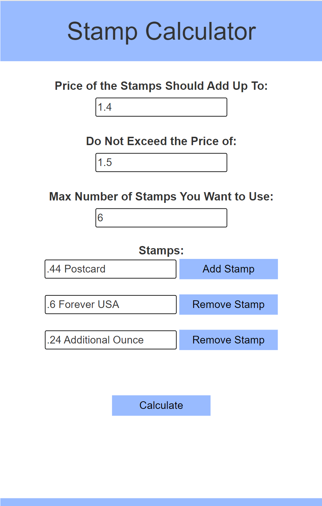
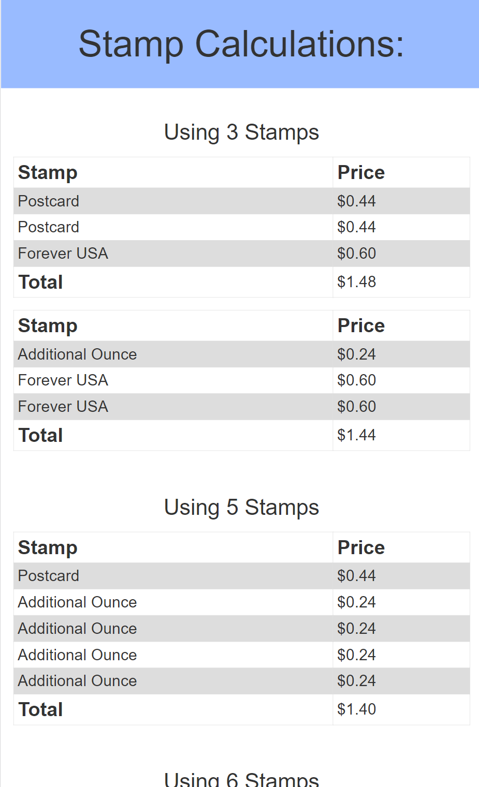

# Stamp-Calculator
This app gets all possible stamp combinations to meet a given price. The user enters the price they want their stamps to add up to, the price they do not want to exceed with their stamp combinations, and all possible stamps. Then when they click the Calculate button, they will see tables that show the possible stamp combinations.

